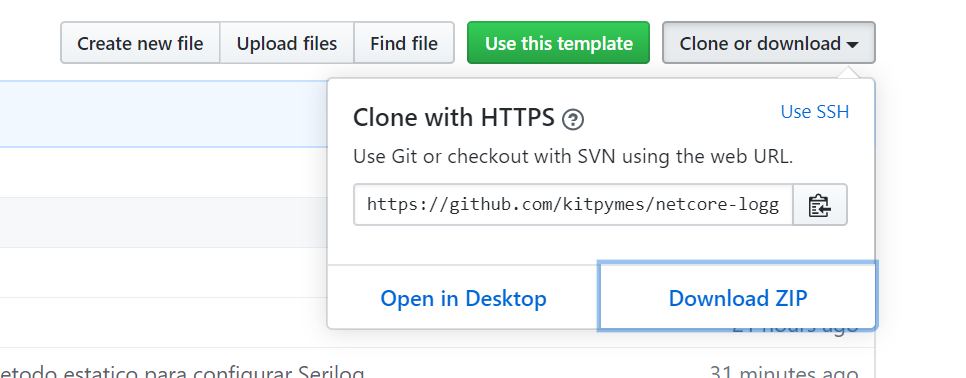
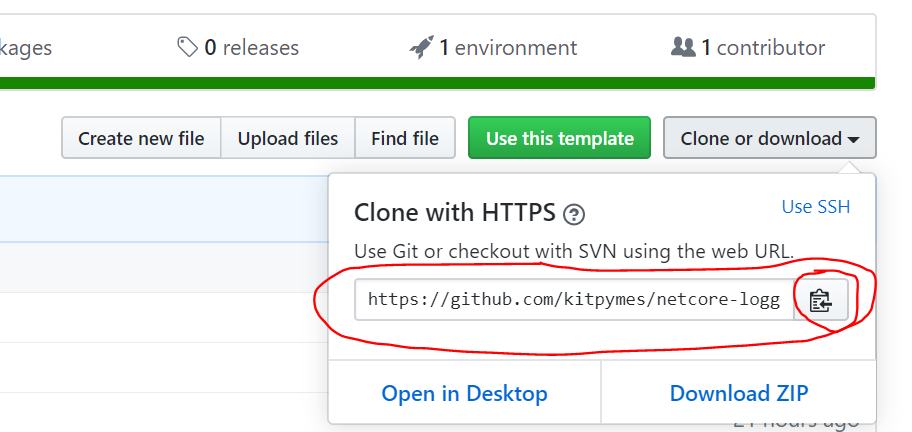
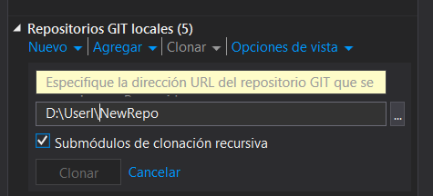

# Logger

_Logeo de errores para multiples proveedores_

## 🚀 Comenzando 

_Estas instrucciones te permitirán obtener una copia del proyecto en funcionamiento en tu máquina local para propósitos de desarrollo y pruebas._

Mira **Instalación** para conocer como desplegar el proyecto.

### 📋 Pre-requisitos 

_- Saber sobre dependencia de injeccion_

_- Tener instalado Visual Studio >= 2019_

_- Tener habilitado tipos nullables_

_- Tener instalada una version >= .NET Core 3_

```xml
<Project Sdk="Microsoft.NET.Sdk">

  <PropertyGroup>
    <TargetFramework>netcoreapp3.0</TargetFramework>
    <Nullable>enable</Nullable>
  </PropertyGroup>

</Project>
```

### 🔧 Instalación 

_Descargar ZIP_



```
1 - Descomprimir zip

2 - Abrir "Solution.sln" y esperar a que visual studio cargue todas las dependencias

3 - Ejecutar
```

_Clonar_





```
1 - Copiamos el link para clonar el proyecto

2 - Clonamos el proyecto en la ubicacion que eligamos localmente

3 - Ejecutar
```

_Resultado en la consola_


_Resultado en los archivos_


**NOTAS**

```
- Si descargamos el proyecto no copiarlo en el escritorio, es posible que tengamos problemas con los permisos de escritura.

- Para probar el envio de email, es posible que tengamos problemas de permisos con nuestro proveedor, eso pasa con gmail por ejemplo.
```

## ⌨️ Codigo y como utilizar


### ILoggerService

```cs
public interface ILoggerService
{
    LoggerService CreateLogger(string sourceContext);

    LoggerService CreateLogger<TSourceContext>();
}
```

### LoggerService

```cs
public abstract class LoggerService
{
	public LoggerService Error(string message);

	public LoggerService Error(string message, object data);

	public LoggerService Error(string eventName, string template, params object[] propertyValues);

	public LoggerService Error(Exception exception);

	public LoggerService Info(string message);

	public LoggerService Info(string message, object data);

	public LoggerService Info(string eventName, string template, params object[] propertyValues);
}
```

### AppSettings

```js
{
    "LoggerSettings": {
        "Serilog": {
            "Console": {
                "Enabled": null, // (bool) Default: false
                "MinimumLevel": null, // (string) Default: "Info" | Options: Info, Error
                "OutputTemplate": null // (string) Default: "{SourceContext}{NewLine}{Timestamp:HH:mm:ss:ff} [{Level:u3}] {Message:lj}{NewLine}"
            },
            "File": {
                "Enabled": null, // (bool) Default: false
                "FilePath": null, // (string) Default: "Logs\\.log"
                "Interval": null, // (string) Default: "Day" | Options: Infinite, Year, Month, Day, Hour, Minute
                "MinimumLevel": null // (string) Default: "Error" | Options: Info, Error
            },
            "Email": {
                "Enabled": null, // (bool) Default: false
                "UserName": null, // (string)
                "Password": null, // (string)
                "Server": null, // (string)
                "From": null, // (string)
                "To": null, // (string)
                "EnableSsl": null, // (bool) Default: true
                "Port": null, // (int) Default: 465
                "Subject": null, // (string) Default: "Log Error"
				"IsBodyHtml": null, // (bool) Default: false
                "MinimumLevel": null, // (string) Default: "Error" | Options: Info, Error,
                "OutputTemplate": null // (string) Default: "SourceContext: {SourceContext} | MachineName: {MachineName} | Process: {Process} | Thread: {Thread} => {NewLine}{Timestamp:yyyy-MM-dd HH:mm:ss.fff} [{Level:u}] {Message:lj}{NewLine}"
            }
        }
    }
}
```

### How load Dependency Injection Logger ?

**Option 1**

```cs
services.LoadLogger(Configuration);
```

**Option 2**

```cs
services.LoadLogger(loggers =>
{
    loggers.UseSerilog(serilog =>
    {
		serilog
			.AddConsole()
			.AddFile()
			.AddEmail
			(
				userName: "admin@app.com", 
				password: "password",
				server: "smtp.gmail.com",
				from: "admin@app.com",
				to: "error@app.com"
			);
    });
});
```

### How use Dependency Injection Logger ?

```cs
[ApiController]
[Route("[controller]")]
public class WeatherForecastController : ControllerBase
{
    private static readonly string[] Summaries = new[]
    {
        "Freezing", "Bracing", "Chilly", "Cool", "Mild", "Warm", "Balmy", "Hot", "Sweltering", "Scorching"
    };

    private LoggerService Logger { get; }

    public WeatherForecastController(ILoggerService logger)
    {
        Logger = logger.CreateLogger<WeatherForecastController>();
    }

    [HttpGet]
    public IEnumerable<WeatherForecast> Get()
    {
        // Enable and customize logger in appsettings, or in Startup class.
        Logger
            .Info("Get Summaries")
            .Info("Summary 1", Summaries[0])
            .Info("Summary 2", Summaries[1])
            .Info("Summary 3", Summaries[2])
            .Info("All Summaries", Summaries);

        var rng = new Random();

        return Enumerable.Range(1, 5).Select(index => new WeatherForecast
        {
            Date = DateTime.Now.AddDays(index),
            TemperatureC = rng.Next(-20, 55),
            Summary = Summaries[rng.Next(Summaries.Length)]
        })
        .ToArray();
    }
}
```

### How load Static Logger ?

**Option 1**

```cs
var logger = Log.UseSerilog(serilog => 
{
	serilog
		.AddConsole()
		.AddFile()
		.AddEmail
		(
			userName: "admin@app.com", 
			password: "password",
			server: "smtp.gmail.com",
			from: "admin@app.com",
			to: "error@app.com"
		);
})
.CreateLogger<Program>();
```

**Option 2**

```cs
var logger = Log.UseSerilog(new SerilogSettings 
{
	// Custom values

}).CreateLogger<Program>();
```

### How use Static Logger ?

```cs
public class Program
{
    public static void Main(string[] args)
    {	
        var logger = Log.UseSerilog(serilog => 
		{
			serilog
				.AddConsole()
				.AddFile()
				.AddEmail
				(
					userName: "admin@app.com", 
					password: "password",
					server: "smtp.gmail.com",
					from: "admin@app.com",
					to: "error@app.com"
				);
		})
		.CreateLogger<Program>();

        try
        {
            logger.Info("Init Host...");

            CreateHostBuilder(args).Build().Run();
        }
        catch (Exception ex)
        {
            logger.Error(ex);

            throw ex;
        }
    }
}
```


## ⚙️ Ejecutando las pruebas 

_Cada proveedor de logeo de errores tiene su proyecto de test, se ejecutan desde el "Explorador de pruebas"_


## 🛠️ Construido con 

* [NET Core](https://dotnet.microsoft.com/download) - El framework web usado
* [nuget](https://www.nuget.org/) - Manejador de dependencias
* [Visual Studio](https://visualstudio.microsoft.com/) - Entorno de programacion
* [Serilog](https://serilog.net/) - Proveedor de logeo de errores


## ✒️ Autores 

* **Kitpymes** - *Trabajo Inicial* - [kitpymes](https://github.com/kitpymes)


## 📄 Licencia 

Este proyecto está bajo la Licencia [LICENSE.md](LICENSE.md)


## 🎁 Expresiones de Gratitud 

* Este proyecto fue diseñado para compartir, creemos que es la mejor forma de ayudar 📢
* Cada persona que contribuya sera invitada a tomar una 🍺 
* Gracias a todos! 🤓

---
[Kitpymes](https://github.com/kitpymes) 😊