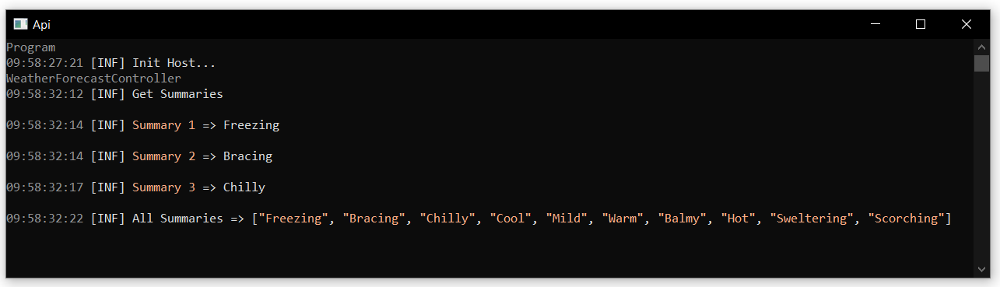
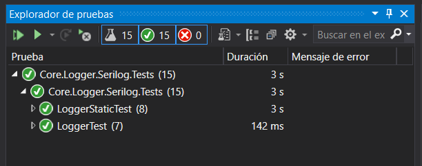

#  Logger

**Logeo de errores para multiples proveedores**

[](https://github.com/kitpymes/template-netcore-logger/actions)
[](https://www.nuget.org/packages/Kitpymes.Core.Logger/)
[](https://github.com/kitpymes/template-netcore-logger/blob/master/docs/LICENSE.txt)
[](https://github.com/kitpymes/template-netcore-logger/)
[](https://github.com/kitpymes/template-netcore-logger/)

## 📋 Requerimientos 

* Visual Studio >= 2019 (v16.3)

* NET TargetFramework >= netcoreapp3.0

* Net Core SDK >= 3.0.100

* C# >= 8.0

* Conocimientos sobre Inyección de Dependencias

## ⌨️ Código

```cs
public interface ILoggerService
{
    ILogger CreateLogger(string title);

    ILogger CreateLogger<TTitle>();
}
```

```cs
public interface ILogger
{
    ILogger Trace(string message);

	ILogger Trace(string message, object data);

	ILogger Debug(string message);

	ILogger Debug(string message, object data);

	ILogger Info(string message);

	ILogger Info(string message, object data);

	ILogger Info(string eventName, string templateMessage, params object[] propertyValues);

	ILogger Error(string message);

	ILogger Error(string message, object data);

	ILogger Error(string eventName, string templateMessage, params object[] propertyValues);

	ILogger Error(Exception exception);
}
```

```cs
public enum LoggerLevel
{
    Trace = 0,

    Debug = 1,

    Info = 2,

    Error = 3,
}
```

```cs
public enum LoggerFileInterval
{
    Infinite = 0,

    Year = 1,

    Month = 2,

    Day = 3,

    Hour = 4,

    Minute = 5,
}
```

```js
{
    "LoggerSettings": {
        "Serilog": {
            "Console": {
                "Enabled": null, // (bool) Default: false
                "MinimumLevel": null, // (string) Default: "Info" | Options: Trace, Debug, Info, Error
                "OutputTemplate": null // (string) Default: "{SourceContext}{NewLine}{Timestamp:HH:mm:ss:ff} [{Level:u3}] {Message:lj}{NewLine}"
            },
            "File": {
                "Enabled": null, // (bool) Default: false
                "FilePath": null, // (string) Default: "Logs\\.log"
                "Interval": null, // (string) Default: "Day" | Options: Infinite, Year, Month, Day, Hour, Minute
                "MinimumLevel": null // (string) Default: "Error" | Options: Info, Error
            },
            "Email": {
                "Enabled": null, // (bool) Default: false
                "UserName": null, // (string)
                "Password": null, // (string)
                "Server": null, // (string)
                "From": null, // (string)
                "To": null, // (string)
                "EnableSsl": null, // (bool) Default: true
                "Port": null, // (int) Default: 465
                "Subject": null, // (string) Default: "Log Error"
				"IsBodyHtml": null, // (bool) Default: false
                "MinimumLevel": null, // (string) Default: "Error" | Options: Info, Error,
                "OutputTemplate": null // (string) Default: "SourceContext: {SourceContext} | MachineName: {MachineName} | Process: {Process} | Thread: {Thread} => {NewLine}{Timestamp:yyyy-MM-dd HH:mm:ss.fff} [{Level:u}] {Message:lj}{NewLine}"
            }
        }
    }
}
```

### Para utilizarlo con inyección de dependencia

**Option 1**

```cs
services.LoadLogger(Configuration);
```

**Option 2**

```cs
services.LoadLogger(loggers =>
{
    loggers.UseSerilog(serilog =>
    {
		serilog
			.AddConsole()
			.AddFile()
			.AddEmail
			(
				userName: "admin@app.com", 
				password: "password",
				server: "smtp.gmail.com",
				from: "admin@app.com",
				to: "error@app.com"
			);
    });
});
```

**Option 3**

```cs
services.LoadLogger(new SerilogSettings 
{
	// Custom values
});
```

**Ejemplo**

```cs
using Kitpymes.Core.Logger.Abstractions;
using Microsoft.AspNetCore.Mvc;
using System;
using System.Collections.Generic;
using System.Linq;

namespace Tests.Api.Controllers
{
    [ApiController]
    [Route("[controller]")]
    public class WeatherForecastController : ControllerBase
    {
        private static readonly string[] Summaries = new[]
        {
            "Freezing", "Bracing", "Chilly", "Cool", "Mild", "Warm", "Balmy", "Hot", "Sweltering", "Scorching"
        };

        //private readonly ILogger<WeatherForecastController> _logger;

        //public WeatherForecastController(ILogger<WeatherForecastController> logger)
        //{
        //    _logger = logger;
        //}

        private ILogger Logger { get; }

        public WeatherForecastController(ILoggerService logger)
        {
            Logger = logger.CreateLogger<WeatherForecastController>();
        }

        [HttpGet]
        public IEnumerable<WeatherForecast> Get()
        {
            // Test
            Logger
               .Info("Get Summaries")
               .Info("Summary 1", Summaries[0])
               .Info("Summary 2", Summaries[1])
               .Info("Summary 3", Summaries[2])
               .Info("All Summaries", Summaries);

            var rng = new Random();
            return Enumerable.Range(1, 5).Select(index => new WeatherForecast
            {
                Date = DateTime.Now.AddDays(index),
                TemperatureC = rng.Next(-20, 55),
                Summary = Summaries[rng.Next(Summaries.Length)]
            })
            .ToArray();
        }
    }
}
```

### Para utilizarlo de forma estatica

**Option 1**

```cs
var configuration = new ConfigurationBuilder().AddJsonFile("appsettings.json").Build();
var logger = Log.UseSerilog(configuration).CreateLogger<Program>();
```

**Option 2**

```cs
var logger = Log.UseSerilog(serilog => 
{
	serilog
		.AddConsole()
		.AddFile()
		.AddEmail
		(
			userName: "admin@app.com", 
			password: "password",
			server: "smtp.gmail.com",
			from: "admin@app.com",
			to: "error@app.com"
		);
})
.CreateLogger<Program>();
```

**Option 3**

```cs
var logger = Log.UseSerilog(new SerilogSettings 
{
	Console = new SerilogConsoleSettings
    {
        Enabled = true
    },
    File = new SerilogFileSettings
    {
        Enabled = true
    },
    Email = new SerilogEmailSettings
    {
        Enabled = false
    }

}).CreateLogger<Program>();
```

**Ejemplo**

```cs
using Kitpymes.Core.Logger;
using Kitpymes.Core.Logger.Abstractions;
using Microsoft.AspNetCore.Hosting;
using Microsoft.Extensions.Hosting;
using Microsoft.Extensions.Logging;
using System;

namespace Tests.Api
{
    public class Program
    {
        public static void Main(string[] args)
        {
            var logger = Log.UseSerilog(serilog =>
            {
                serilog
                    .AddConsole
                    (
                        
                    )
                    .AddFile
                    (
                        minimumLevel: LoggerLevel.Info
                    )
                    .AddEmail
                    (
                        userName: "admin@app.com",
                        password: "password",
                        server: "smtp.gmail.com",
                        from: "admin@app.com",
                        to: "error@app.com"
                    );
            })
           .CreateLogger<Program>();

            try
            {
                logger.Info("Init Host...");

                CreateHostBuilder(args).Build().Run();
            }
            catch (Exception ex)
            {
                logger.Error(ex);

                throw ex;
            }
        }

        public static IHostBuilder CreateHostBuilder(string[] args) =>
            Host.CreateDefaultBuilder(args)
                // (OPCIONAL)
                .ConfigureLogging(providers => providers.ClearProviders())
                .ConfigureWebHostDefaults(webBuilder =>
                {
                    webBuilder.UseStartup<Startup>();
                });
    }
}

```

## 🔩 Resultados

**Resultado en la consola**




**Resultado en los archivos**


## ⚙️ Pruebas Unitarias

_Cada proveedor de logeo de errores tiene su proyecto de test, se ejecutan desde el "Explorador de pruebas"_




## 🛠️ Construido con 

* [NET Core](https://dotnet.microsoft.com/download) - Framework de trabajo
* [C#](https://docs.microsoft.com/es-es/dotnet/csharp/) - Lenguaje de programación
* [Inserción de dependencias](https://docs.microsoft.com/es-es/aspnet/core/fundamentals/dependency-injection?view=aspnetcore-3.0) - Patrón de diseño de software
* [MSTest](https://docs.microsoft.com/es-es/dotnet/core/testing/unit-testing-with-mstest) - Pruebas unitarias
* [Nuget](https://www.nuget.org/) - Manejador de dependencias
* [Visual Studio](https://visualstudio.microsoft.com/) - Entorno de programacion
* [Serilog](https://serilog.net/) - Proveedor de logeo de errores


## ✒️ Autores 

* **Kitpymes** - *Trabajo Inicial* - [kitpymes](https://github.com/kitpymes)


## 📄 Licencia 

* Este proyecto está bajo la Licencia [LICENSE](LICENSE.txt)


## 🎁 Gratitud 

* Este proyecto fue diseñado para compartir, creemos que es la mejor forma de ayudar 📢
* Cada persona que contribuya sera invitada a tomar una 🍺 
* Gracias a todos! 🤓

---
[Kitpymes](https://github.com/kitpymes) 😊